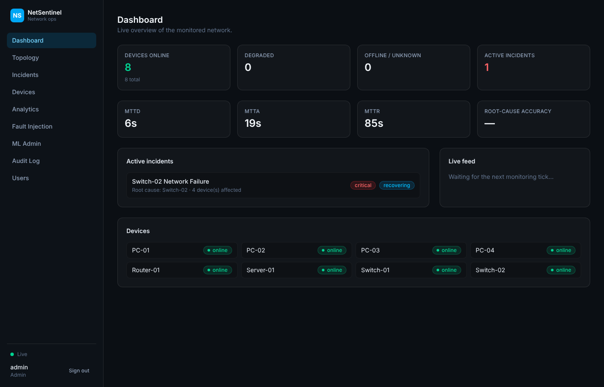
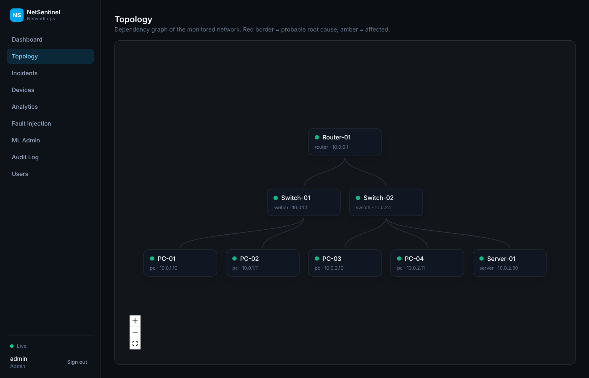
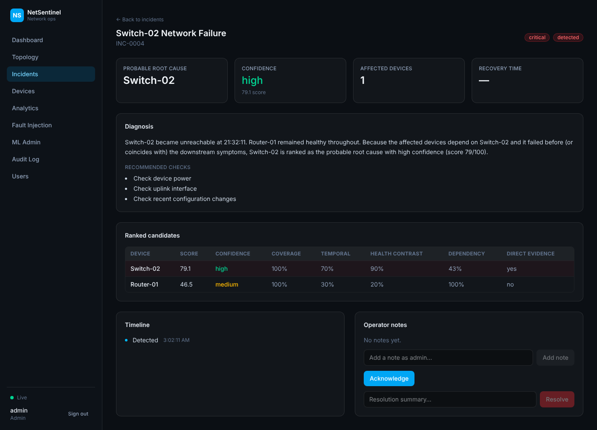

# NetSentinel

An intelligent network monitoring, fault-detection and root-cause-analysis
platform. Simulated devices produce real, live telemetry; the backend
collects, validates, detects anomalies (rules + adaptive baselines + an
Isolation Forest), correlates simultaneous symptoms across the network
topology into a single diagnosed incident with a transparent confidence
score, and tracks it through to automatic recovery -- all visible live in
a React dashboard over WebSockets.

It's a working end-to-end pipeline, not a UI mockup over static data:
**Collect → Validate → Store → Monitor → Detect → Analyze → Correlate →
Diagnose → Alert → Recover → Report.**



## What it does

- **Simulated network** of 8 devices (router, 2 switches, 4 PCs, a
  server) with realistic per-device baseline telemetry, plus a
  **Fault Injection Lab** to trigger switch failure, high latency,
  packet-loss bursts, bandwidth saturation, or a collector outage on
  demand.
- **Real ICMP polling**, optionally, alongside the simulator: set a
  device's `monitoring_method` to `icmp` (Devices page or `PATCH
  /devices/{id}`) and `POLLING_MODE=hybrid` or `live`, and that device
  is really pinged for reachability, latency and packet loss instead of
  simulated. CPU/memory/bandwidth still need SNMP, which isn't built.
- **Detection**: fixed-threshold rules with hysteresis (no flapping on a
  single noisy poll), adaptive per-device baselines (robust
  median/MAD statistics, not fixed numbers), and an Isolation Forest
  anomaly model trained on accumulated telemetry.
- **Correlation + root cause**: simultaneous symptoms are clustered by
  network topology and scored into ranked root-cause candidates with a
  full, inspectable breakdown -- never a bare confidence number.
- **Incident lifecycle**: detected → investigating → acknowledged →
  recovering → resolved, with acknowledge/note/resolve actions, blast
  radius, recommended checks, and a generated diagnosis.
- **Collector-outage isolation**: a monitoring outage is detected and
  shown as exactly that -- it never gets mistaken for every device going
  down at once (covered by an automated test, not just a demo claim).
- **Role-based access** (viewer / operator / admin), a full audit log,
  and live evaluation metrics (MTTD/MTTA/MTTR, root-cause accuracy,
  false-positive rate) computed from real incident history.
- **Alerting**: console log (always on), a generic Slack-compatible
  webhook, and real SMTP email, all independent of each other so one
  misconfigured channel never blocks the others.

| Topology view | Incident root-cause analysis |
|---|---|
|  |  |

## Quick start

```bash
cp .env.example .env
docker compose up --build
```

Then open **http://localhost:5173** and log in as `admin` / `admin123`
(also `operator` / `operator123`, `viewer` / `viewer123`). See
[`docs/DEPLOYMENT.md`](docs/DEPLOYMENT.md) for the no-Docker local setup
and full configuration reference, and
[`docs/DEMO.md`](docs/DEMO.md) for a guided walkthrough of the whole
pipeline including fault injection.

## Stack

**Backend:** Python, FastAPI, SQLAlchemy 2.0, Postgres, NetworkX,
scikit-learn/pandas, JWT auth, WebSockets.
**Frontend:** React, TypeScript, Vite, Tailwind CSS, React Flow (topology
graph), Recharts.

## Project layout

```
backend/    FastAPI app: simulator, collector, detection, ML, correlation,
            incident engine, REST + WebSocket API, pytest suite
frontend/   React + TypeScript SPA
docker/     (see docker-compose.yml at repo root + each app's Dockerfile)
docs/       Architecture, deployment, and demo-script documentation
scripts/    Local dev setup / reset / test-runner convenience scripts
```

## Documentation

- [`docs/ARCHITECTURE.md`](docs/ARCHITECTURE.md) -- how the pipeline
  actually works tick-by-tick, the root-cause scoring formula, and the
  production-scale evolution path for the parts kept deliberately simple
  here.
- [`docs/DEPLOYMENT.md`](docs/DEPLOYMENT.md) -- Docker and native setup,
  configuration reference, troubleshooting.
- [`docs/DEMO.md`](docs/DEMO.md) -- step-by-step walkthrough of the full
  pipeline.
- API reference: once running, Swagger UI is at
  `http://localhost:8000/docs`.

## Scope note

This is built to an explicit "essential prototype" scope: the full
pipeline above, working end-to-end and verified (automated tests +
real browser walkthroughs, not just assumed to work), rather than a
shallower pass across every item in the original spec. Auth, RBAC,
Docker, notifications (console/webhook/email) and audit logging are all
in, and real ICMP polling is available per-device alongside the
simulator; a few longer-roadmap items from the original spec (SNMP
polling for CPU/memory/bandwidth on real hardware, a real model
registry, multi-tenant scale) are intentionally out of scope for now --
see `docs/ARCHITECTURE.md` for exactly what and why.
